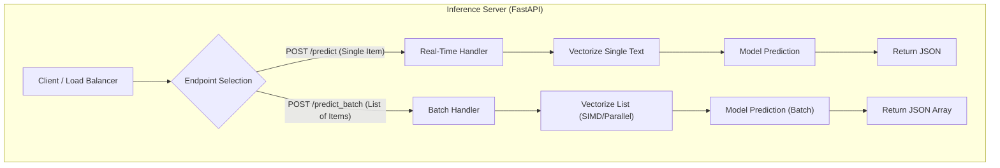

# TrueSight Latency Engine

**A High-Performance Inference Engine for Real-Time Fake News Detection.**

This project bridges the gap between **training a model** and **serving it at scale**. It implements a production-grade **FastAPI** system designed to handle high-concurrency traffic, demonstrating the critical performance difference between **Real-Time (Online)** and **Batch (Offline)** inference strategies.

---

## System Architecture

The system exposes two distinct inference strategies. The following flowchart illustrates the data flow for both endpoints:



---

## Key Differentiators

Unlike standard model deployments, this engine is optimized for engineering efficiency:

1. **Global Model State (Cold Start Optimization):**
* **Standard:** Loads the model inside the function (slows down every request).
* **TrueSight:** Loads the model into global memory *once* on startup, making inference instant.


2. **Dual-Mode Architecture:**
* **The Taxi (Real-Time):** Optimized for single, low-latency requests (e.g., Chatbots).
* **The Bus (Batch Processing):** Optimized for high-throughput volume (e.g., Social Media Feeds).


3. **Stress-Tested Reality:**
* Validated not just with code, but with a **100-User Concurrent Swarm** using Locust.


---

## Performance Benchmarks

We conducted a stress test simulating **100 concurrent users** attacking the API.

| Metric | Real-Time API (The Taxi) | Batch API (The Bus) | Result |
| --- | --- | --- | --- |
| **Requests Per Sec** | ~5.1 RPS | ~5.6 RPS | Slight Gain |
| **Items Processed/Sec** | **5.1 items/s** | **28.0 items/s** | **5.5x Throughput** 🚀 |
| **Latency Strategy** | Serial Processing | Vectorized Parallelism | **Massive Efficiency** |

*Conclusion: By switching to Batch Inference, we increased the system's capacity by over 500% without changing the hardware.*

---

## Tech Stack

* **Serving Framework:** FastAPI, Uvicorn (Asynchronous Server)
* **Machine Learning:** Scikit-Learn, Joblib (Vectorization & Inference)
* **Stress Testing:** Locust (Distributed Load Testing)
* **Client Testing:** cURL, Python Requests

---

## Installation & Usage

### 1. Prerequisites

Ensure Python 3.8+ is installed.

```bash
pip install fastapi uvicorn scikit-learn joblib locust

```

### 2. Start the Engine

```bash
uvicorn main:app --reload

```

*The server will start at `http://127.0.0.1:8000*`

### 3. Run the Stress Test

```bash
locust -f locustfile.py

```

*Open `http://localhost:8089` to launch the attack swarm.*

---

## Project Structure

* `main.py`: The application entry point containing API definitions and model loading logic.
* `locustfile.py`: Load testing script defining user behaviors for single and batch requests.
* `best_fake_news_model.pkl`: Serialized Machine Learning model.
* `tfidf_vectorizer_best.pkl`: Serialized TF-IDF vectorizer.
